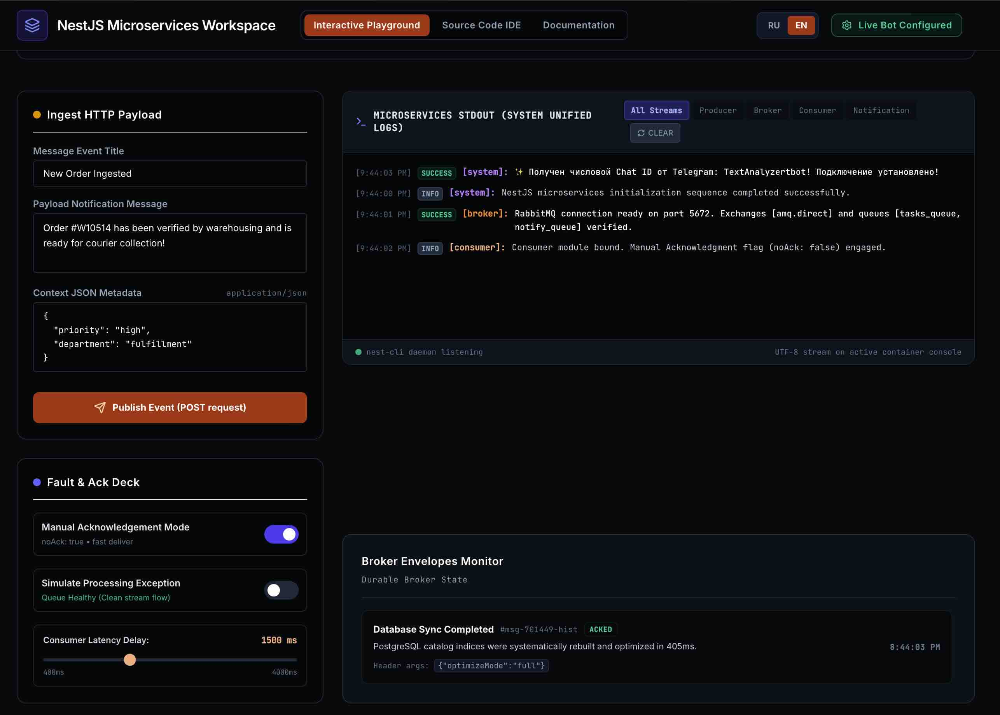
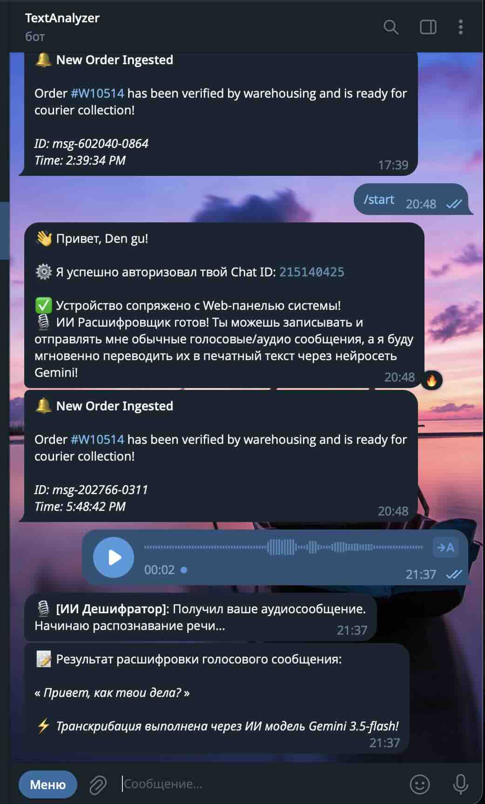

# NestJS & RabbitMQ Microservices Workspace

Этот репозиторий представляет собой отказоустойчивую, горизонтально масштабируемую микросервисную экосистему на базе **NestJS**, брокера сообщений **RabbitMQ** и **Telegram Bot API** для отправки уведомлений.

Интерфейс управления, встроенный в проект, позволяет наглядно визуализировать трафик сообщений, мониторить состояние очередей в реальном времени, тестировать симуляцию нагрузки и настраивать получателей.

---

<div align="center" style="margin: 24px 0; display: flex; justify-content: center; align-items: center; gap: 24px; flex-wrap: wrap;">
  
  
</div>

## 🗺️ Общая архитектура системы

Экосистема спроектирована по принципам **SOLID** и разделения ответственности (**Separation of Concerns**). Система состоит из трёх независимых микросервисов, выполняющих свои строго определённые роли:

```
[ Клиент / Браузер / REST API ]
             │
             │ HTTP POST /api/events/send
             ▼
 ┌───────────────────────┐
 │   Producer Service    │  — Принимает запрос, мгновенно валидирует схему,
 │ (Входной REST API)    │    генерирует транзакционный UUID, отправляет задачу
 └──────────┬────────────┘    в RabbitMQ (`tasks_queue`) и моментально возвращает 202 Accepted.
            │
            │ tasks_queue (Асинхронная доставка)
            ▼
 ┌───────────────────────┐
 │       RabbitMQ        │  — Буферизует сообщения, обеспечивает сохранность данных
 │   (Message Broker)    │    и распределяет нагрузку между воркерами.
 └──────────┬────────────┘
            │
            │ process_task (Подписка/Воркер)
            ▼
 ┌───────────────────────┐
 │   Consumer Service    │  — Потребляет сырые события («воркер»), выполняет «тяжёлую»
 │ (Бизнес-логика)       │    бизнес-логику, трансформирует данные в HTML-уведомление
 └──────────┬────────────┘    и отправляет команду на отправку в `notify_queue`.
            │
            │ notify_queue
            ▼
 ┌───────────────────────┐
 │       RabbitMQ        │  — Очередь для отправки готовых уведомлений.
 └──────────┬────────────┘
            │
            │ send_tg_notification
            ▼
 ┌───────────────────────┐
 │ Notification Service  │  — Слушает очередь уведомлений и отправляет их в
 │ (Внешняя интеграция)  │    Telegram Bot API с поддержкой политики повторных попыток.
 └──────────┬────────────┘
            │
            │ HTTPS API (fetch)
            ▼
     [ Telegram Bot ] ──> [ Ваше устройство ]
```

---

## 🛠️ Подробный разбор роли каждого сервиса

### 1. Producer Service (Генератор / Приемщик событий)

- **Какую роль играет:** Это единственная «точка входа» снаружи для веб-клиентов. Он берёт на себя всю тяжесть HTTP-запросов и защищает внутреннюю архитектуру.
- **Что под капотом:** NestJS с производительным сетевым адаптером **Fastify**, валидацией входящих данных через `class-validator` и автогенерацией спецификации **Swagger (OpenAPI)**.
- **Как работает:**
  1. Принимает JSON- payload с заголовком и текстом.
  2. Генерирует уникальный `transactionId` (UUID v4) для обеспечения **идемпотентности** (чтобы систему нельзя было случайно перегрузить дубликатами).
  3. Отправляет сообщение во внутреннюю шину `tasks_queue` брокера RabbitMQ.
  4. Моментально отвечает пользователю статус-кодом **202 Accepted** (задача принята в обработку), не заставляя его ждать выполнения тяжелых операций.

### 2. Consumer Service (Обработчик событий и бизнес-логика)

- **Какую роль играет:** Это асинхронный фоновый «воркер». Его задача — изолированно выполнять тяжелую вычислительную работу, операции с БД, парсинг или форматирование.
- **Что под капотом:** Легковесный гибридный микросервис NestJS, подключенный к RabbitMQ.
- **Как работает:**
  1. Слушает сообщения по шаблону `process_task` из очереди `tasks_queue`.
  2. Включает ручное подтверждение доставки сообщений (`noAck: false`). Это значит, что если воркер упадет в процессе работы (например, пропадет сеть), сообщение не потеряется, а вернётся в очередь другим воркерам.
  3. Форматирует сообщение: преобразует текст в красивую HTML-разметку с эмодзи и временными метками.
  4. Отправляет готовую команду на отправку уведомления в следующую специализированную очередь — `notify_queue`.
  5. Только после успешного завершения всех шагов отправляет RabbitMQ команду подтверждения (`ACK`).

### 3. Notification Service (Сервис рассылки / Телеграм бот)

- **Какую роль играет:** Ограждает систему от задержек сторонних REST API. Любое внешнее сетевое взаимодействие (будь то Telegram, Viber, SMS, Email) всегда должно быть вынесено в отдельный независимый сервис.
- **Что под капотом:** Изолированный NestJS микросервис, взаимодействующий исключительно по протоколу AMQP (RabbitMQ) и делающий защищенные запросы к HTTPS API Telegram.
- **Как работает:**
  1. Получает готовую HTML-команду на отправку из очереди `notify_queue`.
  2. Извлекает токен бота (`TELEGRAM_BOT_TOKEN`) и ID чата (`TELEGRAM_CHAT_ID`) из защищенных переменных окружения.
  3. Делает HTTPS-запрос к официальному API Telegram.
  4. **Умная обработка ошибок (Retries):** Если сервер Telegram перегружен или вернул временную ошибку, сервис делает отмену подтверждения доставки сообщений (`NACK`) с флагом `requeue=true`, заставляя RabbitMQ мягко повторить попытку отправки позже.

---

## ⚡ Преимущества такого подхода (Зачем это нужно?)

1. **Абсолютная отказоустойчивость**: Если Telegram временно не работает или упал интернет, ваши пользователи всё равно смогут отправлять события на сайт! Запросы будут надёжно накапливаться в RabbitMQ и мгновенно отправятся в Telegram сразу после восстановления связи.
2. **Нулевое ожидание (Zero Latency)**: Отправитель запроса получает ответ в течение считанных миллисекунд, так как сервису не нужно ждать завершения реальной отправки в соцсети.
3. **Легкое масштабирование**: Если на ваш сайт хлынет миллион запросов, вы можете одной командой запустить 10 экземпляров `Consumer Service` и `Notification Service` в Docker, и они параллельно разберут очередь за секунды.

---

## 🚀 Как запустить экосистему

### Вариант А: Быстрый запуск в Docker (Рекомендуемый)

Убедитесь, что у вас установлены **Docker** и **Docker Compose**.

1. Создайте или отредактируйте файл `.env` в корневом каталоге (по образу `.env.example`):

   ```env
   TELEGRAM_BOT_TOKEN="1234567890:ABC-DEF_your_actual_bot_token"
   TELEGRAM_CHAT_ID="your_telegram_chat_id"
   ```

2. Запустите сборку и старт всех контейнеров одной командой:

   ```bash
   make up-build
   ```

   _Или напрямую через docker:_

   ```bash
   docker-compose up --build -d
   ```

3. **Что произойдет после сборки:**
   - **RabbitMQ** запустится на порту `5672` (управление на `15672`).
   - **Producer (API)** запустится на порту `8001` (или внутренний порт `3001` в зависимости от настроек Docker).
   - **Consumer** и **Notification** запустятся в фоновом режиме в Docker.
   - **Веб-интерфейс (Frontend)** запустится на порту `3000` для визуального управления процессом.

---

### Вариант Б: Локальный запуск на компьютере (без Docker)

Для локального запуска вам понадобится установленный локально RabbitMQ или любое облачное подключение к брокеру сообщений.

1. Установите все зависимости во все директории с помощью готовой команды:

   ```bash
   make install
   ```

2. В файлах конфигураций или `.env` укажите ваш локальный адрес RabbitMQ:

   ```env
   RABBITMQ_URL="amqp://localhost:5672"
   ```

3. Очистите порты и запустите фронтенд и фоновые утилиты:
   ```bash
   make clean-ports
   yarn dev
   ```

---

## 🧑‍💻 Реальный пример использования и тестирования API

### Проверка работоспособности через Swagger

Когда сервис запущен, вы можете открыть встроенную интерактивную документацию Swagger API:

- **Интерфейс Swagger**: `http://localhost:8001/api/docs` (или `http://localhost:3001/api/docs` при локальном запуске).

Там вы сможете в один клик отправить тестовый JSON-запрос и увидеть структуру ответов.

### Пример отправки сообщения через `curl` (терминал):

```bash
curl -X POST http://localhost:8001/api/events/send \
  -H "Content-Type: application/json" \
  -d '{
    "title": "Новый заказ #778",
    "message": "Клиент оплатил корзину! Сумма: 4,500 руб. Срочно соберите посылку.",
    "metadata": {
      "priority": "high",
      "paymentMethod": "card"
    }
  }'
```

**Ответ сервера (мгновенный):**

```json
{
  "success": true,
  "transactionId": "b6a3cc18-18fc-4b36-bf75-231a403bbfe5",
  "destination": "tasks_queue",
  "payload": {
    "id": "b6a3cc18-18fc-4b36-bf75-231a403bbfe5",
    "title": "Новый заказ #778",
    "message": "Клиент оплатил корзину! Сумма: 4,500 руб. Срочно соберите посылку.",
    "metadata": {
      "priority": "high",
      "paymentMethod": "card"
    },
    "timestamp": "2026-05-27T18:57:44.020Z"
  }
}
```

Через секунду вы увидите новое сообщение, пришедшее на ваш телефон через подключенного Telegram-бота!

---

## 🔧 Команды Makefile для удобного управления

Для максимального удобства используйте следующие команды из корня проекта:

- `make up` — Запуск всей экосистемы сервисов в фоновом режиме Docker.
- `make down` — Полная и чистая остановка контейнеров и внутренних сетей.
- `make build` — Пересборка образов Docker.
- `make up-build` — Пересборка и запуск экосистемы одной командой.
- `make logs` — Просмотр логов всех микросервисов в реальном времени (показывает, как сообщения проходят цепочку воркеров).
- `make clean` — Удаление контейнеров, локальных сетей и кэша томов RabbitMQ.
- `make test` — Автоматический запуск юнит/интеграционных тестов во всех сервисах.
